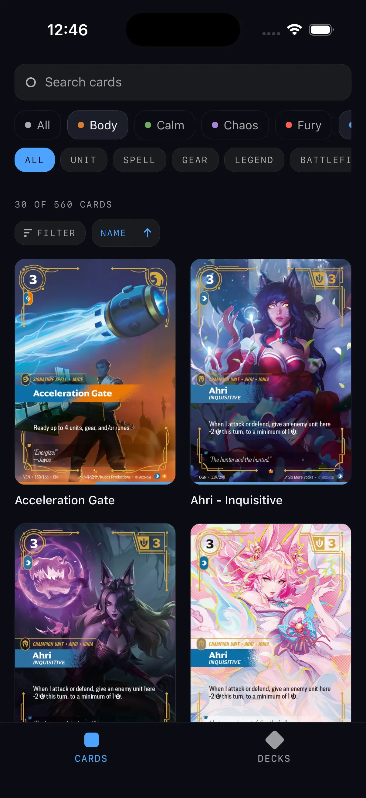
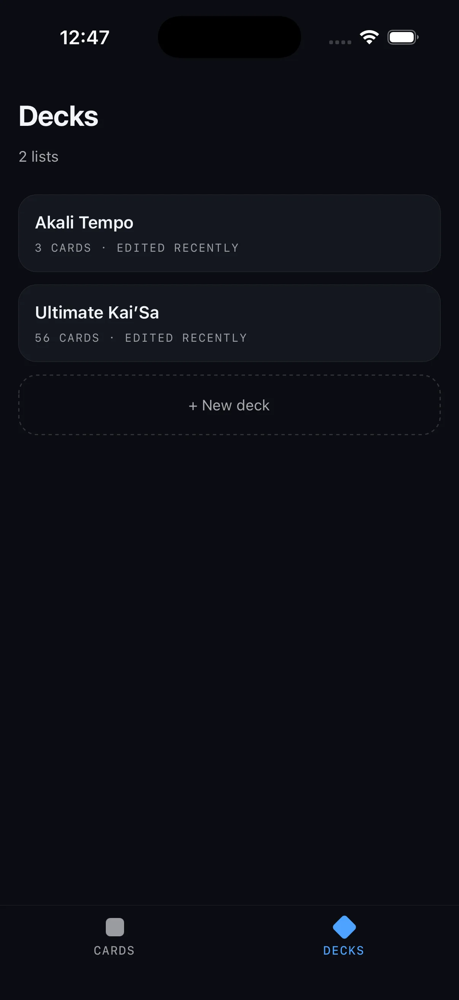
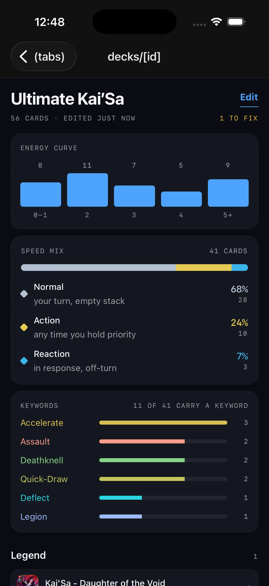
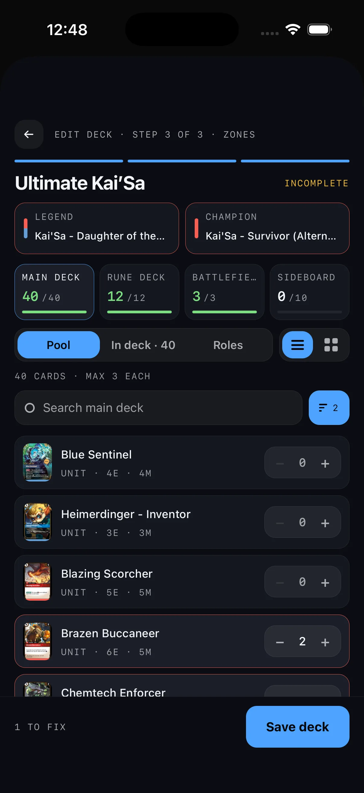

# Riftbound Companion App

This application is a companion app for the Riftbound TCG. With it, Riftbound enjoyers can browse cards with insightful analytics and create casual and/or tournament ready decks.
Deck building is meant to be a playground for players but comes with tournament legality built in as a validation check but not a blocker.

Decks also offer analytical insights based on the card composition. I'm still enriching my data to provide better insights such as hand rolled 'role' designations to classify decks. (Tournament / meta analytics may come at a later date.)

This app started as just a fun way for me to explore my ideas on scalable frontend architecture. However, as a Riftbound player myself, I feel like there is potential to add value to other players on the deck building journeys.

Another planned feature is multiple language support to make providing translations for multi-language decks easy to provide to other players. This means in a casual setting players can use the app. Or, in a more tournament environment users can export their decks to a printable format. (A bit more discovery on tournament rules needed here...)

# Screenshots

<table>
  <tr>
    <td align="center"></td>
    <td align="center"></td>
    <td align="center"></td>
    <td align="center"></td>
  </tr>
  <tr>
    <td align="center">Browsing cards</td>
    <td align="center">Decks</td>
    <td align="center">Deck analytics</td>
    <td align="center">Building a deck</td>
  </tr>
</table>

# Application Architecture For Those Who Are Curious

This application uses a ports & adapters architecutre that separates the concerns of the domain from the implementation of said concerns. Everything the domain cares about lives
in the features directory. This ranges from defining the domain models, business logic, UI, and interfaces for dependencies that application uses.

Implementations of the dependencies live in the infrastructure directory. This allows for implementations to be swapped in/out or mixed together as needed.

Currently, all data comes from a local sqlite database. Later on I will likely need an api layer for fetching some external data such as analytics. Potentially, I will add a backing server for user management and deck sharing. However, for now this is a local-focused application.

This application also uses zod to implement the adage of "Parse, don't validate".

I also have some crude scripts for processing raw data and transforming into seed data for the database. Currently limited by the data I can collect but will get more and/or derive some data such as
card speed (normal / action / reaction) from the raw data I already have (will require parsing the card text since the data I have doesn't treat this as a first class citizen).

All images are just being hosted on my machine over LAN using python's http server and pointing it to my local dir.

As for analytics, everything is being pulled from the local sqlite db. This works OK for now, but querying can be a bit awkward. I'm considering keeping the sqlite db more as an application DB and then creating parquet files to leverage a columnar db querying workflow. Is it necessary? No. But would it be fun? I think so.
